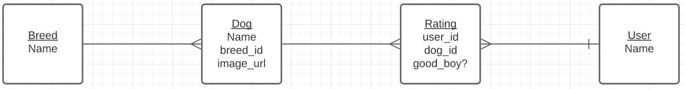

# Puppy Pics App Database
> [Deployed Repo](https://desolate-waters-34836.herokuapp.com/dogs)\
> [Front End Repo](https://github.com/Calvinfr96/puppy-pics-frontend)

This is a Postgre SQL database built for the [Puppy Pics App](https://puppypics.netlify.app/) using Ruby 2.7.4.
Puppy Pics is an app that allows users to view, rate, and upload dogs of various breeds.

The application was created using the rails generator (`rails new [app name] --api --database=postgresql`) and requires the following additional dependencies to work properly:
- Active Model Serializers - `gem 'active_model_serializers'`
- Postgre SQL - `gem 'pg', '~> 1.1'`
- Rack CORS - `gem 'rack-cors'`
- Ruby 2.7.4 - `ruby '2.7.4'`

The database was built using 4 models:
1. Breed
2. Dog
3. Rating
4. User

The following Entity Relationship Diagram shows how the models relate to one another:

